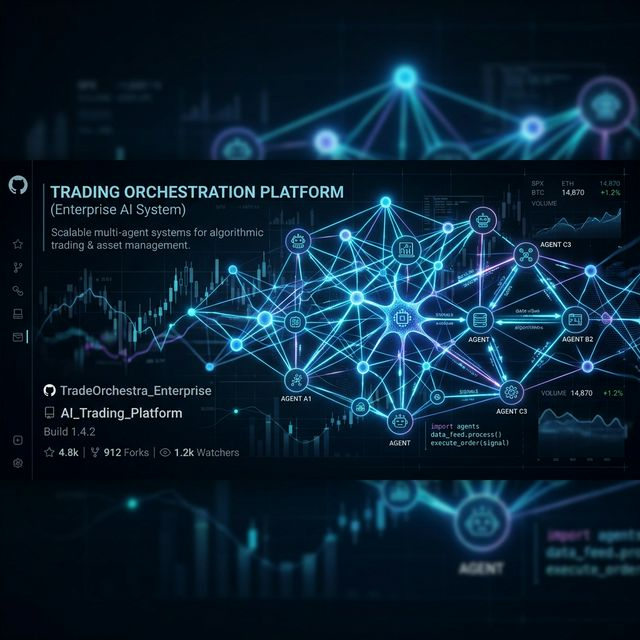
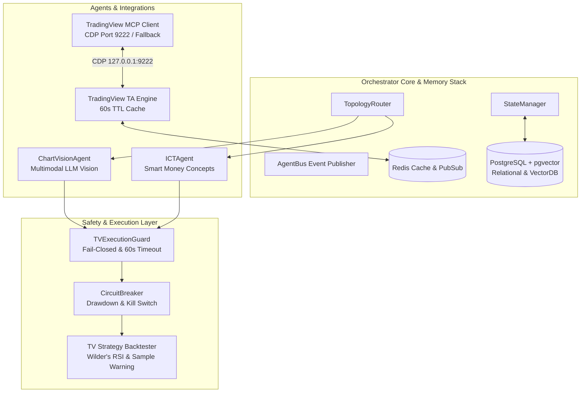

<div align="center">
  
</div>

# TradingAgents (CMAOP) 🚀


Selamat datang di repository **TradingAgents**. Proyek ini adalah monorepo yang menggabungkan **Custom Multi-Agent Orchestration Platform (CMAOP)** canggih di sisi backend (Python), agen **Smart Money Concepts (ICTAgent)**, integrasi **TradingView MCP & Vision**, serta **React Dashboard** pemantauan real-time.

Sistem ini bertindak layaknya tim *Hedge Fund* otonom berbasis LLM, dengan agen-agen spesialis (Technical Analyst, Chart Vision, ICT Analyst, Risk Manager) yang berkolaborasi untuk mengambil keputusan trading dengan pelindung finansial **Fail-Closed**.

---

## 🏗️ Arsitektur Sistem CMAOP

Platform orkestrasi ini dibangun dari nol untuk performa maksimum, keamanan *Fail-Closed*, dan integrasi memori terdistribusi.



---

## 🧠 Fitur Utamadan Komponen Sistem

1. **Native TradingView Dataflow & 60s Cache**:
   - Analisis teknikal 24/7 menggunakan `tradingview-ta` dengan validasi parameter presisi, *retry backoff*, dan *60-second in-memory TTL caching*.
2. **TradingView MCP & ChartVisionAgent**:
   - Integrasi Chrome DevTools Protocol (`127.0.0.1:9222`) untuk otomasi TradingView Desktop.
   - **Fallback Mode First-Class Citizen**: Beralih otomatis ke analisis kuantitatif jika CDP terputus.
   - `ChartVisionAgent`: Subagent multimodal AI untuk menganalisis screenshot chart (trend, pattern, support/resistance).
   - `PineScriptManager`: Validator sintaksis dry-run dan injeksi kode Pine Script v5 terlindungi JWT.
3. **Inner Circle Trader (ICT / Smart Money Concepts) Agent**:
   - Engine analisis kuantitatif presisi (`ICTConfig`):
     - **Displacement Ratio**: Body/ATR14 $\ge 2.0$ (High OB) / $\ge 1.5$ (Medium OB).
     - **Liquidity Sweeps**: Penetrasi wick $> 0.10\%$ dengan *reversal close* dalam $\le 2$ candle.
     - **Fair Value Gaps (FVG)**: Melacak status pengisian 50% Consequent Encroachment (CE) & 100% Fill.
     - **Optimal Trade Entry (OTE)**: Zona Fib 61.8% – 78.6%.
4. **Financial Safety & TVExecutionGuard**:
   - **Fail-Closed Architecture**: Menolak/meminta konfirmasi manual jika data validasi tidak lengkap.
   - **Symmetric Conflict Matrix**: Memblokir sinyal berlawanan (BUY vs STRONG_SELL / SELL vs STRONG_BUY, serta konflik ICT Order Block).
   - **Multiplicative Position Sizing**: Pengurangan ukuran posisi otomatis ($0.75\times$ untuk Medium OB, $0.50\times$ untuk High OB) terintegrasi dengan Kelly Criterion.
   - **60-Second Order Expiration**: Timeout otomatis untuk order yang menunggu konfirmasi.
5. **CircuitBreaker System**:
   - Membatasi kegagalan agen ($N=3$), mencegah *drawdown* portofolio ($>-15\%$), dan dilengkapi *Global Emergency Kill Switch* serta kebijakan *Manual Reset Only*.
6. **React Dashboard & Panel Glassmorphism**:
   - Panel telemetry visual untuk memantau status CDP, indikator teknikal real-time, laporan `ChartVisionAgent`, serta Pine Script Injector box.

---

## 🐳 Deployment 1-Click di VPS (Enterprise Docker Stack)

Proyek ini telah dilengkapi dengan **Docker Compose Enterprise Stack** yang membungkus seluruh dependensi database, cache terdistribusi, backend API, dan frontend dashboard.

### Komponen Container:
- 🐘 **`postgres` (`pgvector/pgvector:pg16`)**: Relational DB + Vector DB untuk memori jangka panjang agen.
- ⚡ **`redis` (`redis:7-alpine`)**: Cache terdistribusi & Pub/Sub event bus.
- 🐍 **`backend` (`tradingagents-backend`)**: Engine FastAPI & Orchestrator Python.
- ⚛️ **`dashboard` (`tradingagents-dashboard`)**: Web server React SPA & Nginx Reverse Proxy.

### Menjalankan di VPS:

```bash
# 1. Clone repositori di VPS
git clone https://github.com/bimoBintang/TradingAgents.git /opt/TradingAgents
cd /opt/TradingAgents

# 2. Jalankan Docker Compose
docker compose up -d --build

# 3. Verifikasi kontainer
docker compose ps
```

### Akses Layanan:
- **Dashboard UI**: `http://<IP-VPS-ANDA>` (Port 80 atau 5173)
- **FastAPI OpenAPI Docs**: `http://<IP-VPS-ANDA>:8000/docs`
- **MCP Status Endpoint**: `http://<IP-VPS-ANDA>:8000/api/tradingview/mcp-status`

---

## 🚀 Penggunaan Lokal & CLI (`orchctl`)

### 1. Menjalankan Backend API (Local Python)

```bash
cd TradingAgents
pip install -e .
uvicorn api.main:app --reload --port 8000
```

### 2. Menjalankan Dashboard UI (Local React)

```bash
cd dashboard
npm install
npm run dev
```

### 3. Menggunakan CLI Terminal (`orchctl`)

```bash
# Periksa status kesehatan TradingView Telemetry & Fail-Closed Guard
python3 -m orchestrator.cli.orchctl tv-status

# Periksa status CircuitBreaker & Agen
python3 -m orchestrator.cli.orchctl status

# Jalankan siklus trading penuh untuk BTCUSDT dengan TradingView & Dry-Run safety
python3 -m orchestrator.cli.orchctl run --ticker BTCUSDT --use-tv
```

---

## 🧪 Menjalankan Automated Test Suite (30/30 Passed)

```bash
# 1. API & Dataflow Tests
python3 -m pytest TradingAgents/tests/test_api_tradingview.py TradingAgents/tests/test_tradingview.py -v

# 2. Orchestrator, MCP, Guard & ICT Agent Tests
python3 -m pytest orchestrator/tests/test_tradingview_mcp.py orchestrator/tests/test_phase4_tv.py orchestrator/tests/test_ict_agent.py -v
```

---

*Hak Cipta © 2026. BimoBintang / TradingAgents.*
