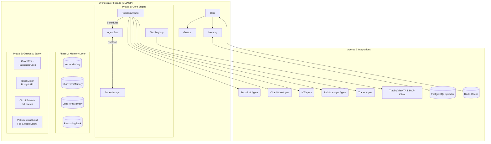

<div align="center">
  
</div>

# TradingAgents (CMAOP) 🚀


Selamat datang di repository **TradingAgents**. Proyek ini adalah monorepo yang menggabungkan **Custom Multi-Agent Orchestration Platform (CMAOP)** canggih di sisi backend (Python) dan Dashboard pemantauan real-time di sisi frontend (React).

Sistem ini bertindak layaknya tim *Hedge Fund* otonom berbasis LLM, dengan agen-agen spesialis (Technical Analyst, Chart Vision, ICT Smart Money Analyst, Risk Manager, Trader Agent) yang berkolaborasi untuk mengambil keputusan trading dengan pelindung finansial **Fail-Closed**.

---

## 🏗️ Arsitektur CMAOP (Core Platform)

Platform orkestrasi ini dibangun dari nol (tanpa framework eksternal) untuk performa maksimum dan kontrol penuh atas *safety* dan *memory*.



---

## 🧠 Komponen Sistem Utama

Sistem ini terdiri dari 4 fase arsitektur utama CMAOP ditambah integrasi TradingView & Smart Money Concepts:

### 1. Core Engine (Phase 1)
- **`AgentBus`**: Mesin komunikasi terdistribusi berbasis *event-driven* (Pub/Sub).
- **`StateManager`**: Penyimpanan memori bersama terisolasi per sesi trading.
- **`TopologyRouter`**: Pengatur alur kerja agen yang mendukung berbagai topologi (*Pipeline*, *Hierarchical*, *Mesh*).
- **`ToolRegistry`**: Pendaftaran dan pembatas akses tool spesifik per agen.

### 2. Memory Layer (Phase 2)
- **`VectorMemory`**: Database vektor untuk pencarian semantik trajektori trading.
- **`ShortTermMemory`**: Memori percakapan agen dengan pembersihan TTL otomatis.
- **`LongTermMemory`**: Penyimpanan lintas sesi untuk rekapan PnL dan statistik historis agen.
- **`ReasoningBank`**: Bank pola keputusan AI yang sukses untuk pembelajaran berkelanjutan.

### 3. Guards & Financial Safety (Phase 3)
- **`GuardRails`**: Mencegah halusinasi ticker/action dan mengunci batasan format output.
- **`TokenMeter`**: Membatasi konsumsi token LLM API (`BudgetExceededError`).
- **`CircuitBreaker`**: Pelindung tingkat sistem (Trigger $N=3$ fails, Drawdown limit $-15\%$, Emergency Kill Switch, & *Manual Reset Only*).
- **`TVExecutionGuard`**: Pelindung finansial **Fail-Closed Architecture**, **Symmetric Long & Short Conflict Matrix**, **60-Second Order Timeout**, dan **Multiplicative Kelly Position Sizing**.

### 4. SDK & CLI (Phase 4)
- Decorator Python terpadu (`@agent` dan `@tool`) untuk kemudahan pembuatan agen baru.
- Utility CLI `orchctl` untuk pemantauan status orkestrasi langsung dari terminal.

---

## ⚡ Fitur Integrasi Lanjutan (TradingView & ICT Smart Money)

1. **Native TradingView Dataflow & 60s Cache**:
   - Analisis teknikal 24/7 via `tradingview-ta` dengan validasi parameter presisi, *retry backoff*, dan *60-second in-memory TTL caching*.
2. **TradingView MCP & ChartVisionAgent**:
   - Integrasi Chrome DevTools Protocol (`127.0.0.1:9222`) untuk otomasi TradingView Desktop.
   - **Fallback Mode First-Class Citizen**: Beralih otomatis ke analisis kuantitatif jika CDP terputus.
   - `ChartVisionAgent`: Subagent multimodal AI untuk menganalisis screenshot chart (trend, pattern, support/resistance).
   - `PineScriptManager`: Validator sintaksis dry-run dan injeksi kode Pine Script v5 terlindungi JWT.
3. **Inner Circle Trader (ICT / Smart Money Concepts) Agent**:
   - Engine analisis kuantitatif presisi (`ICTConfig`):
     - **Displacement Ratio**: Body/ATR14 $\ge 2.0$ (High OB) / $\ge 1.5$ (Medium OB).
     - **Liquidity Sweeps**: Penetrasi wick $> 0.10\%$ dengan *reversal close* dalam $\le 2$ candle.
     - **Fair Value Gaps (FVG)**: Melacak status pengisian 50% Consequent Encroachment (CE) & 100% Fill.
     - **Optimal Trade Entry (OTE)**: Zona Fib 61.8% – 78.6%.

---

## 🐳 Deployment 1-Click di VPS (Enterprise Docker Stack)

Proyek ini telah dilengkapi dengan **Docker Compose Enterprise Stack** yang membungkus seluruh dependensi database, cache terdistribusi, backend API, dan frontend dashboard.

### Komponen Container:
- 🐘 **`postgres` (`pgvector/pgvector:pg16`)**: Relational DB + Vector DB untuk memori jangka panjang agen.
- ⚡ **`redis` (`redis:7-alpine`)**: Cache terdistribusi & Pub/Sub event bus.
- 🐍 **`backend` (`tradingagents-backend`)**: Engine FastAPI & Orchestrator Python.
- ⚛️ **`dashboard` (`tradingagents-dashboard`)**: Web server React SPA & Nginx Reverse Proxy.

### Menjalankan di VPS:

```bash
# 1. Clone repositori di VPS
git clone https://github.com/bimoBintang/TradingAgents.git /opt/TradingAgents
cd /opt/TradingAgents

# 2. Jalankan Docker Compose
docker compose up -d --build

# 3. Verifikasi kontainer
docker compose ps
```

### Akses Layanan:
- **Dashboard UI**: `http://<IP-VPS-ANDA>` (Port 80 atau 5173)
- **FastAPI OpenAPI Docs**: `http://<IP-VPS-ANDA>:8000/docs`
- **MCP Status Endpoint**: `http://<IP-VPS-ANDA>:8000/api/tradingview/mcp-status`

---

## 🚀 Penggunaan Lokal & CLI (`orchctl`)

### 1. Backend Engine (FastAPI & AI Agents)

```bash
cd TradingAgents
pip install -e .
uvicorn api.main:app --reload --port 8000
```

### 2. Frontend Dashboard (React & Vite)

```bash
cd dashboard
npm install
npm run dev
```

### 3. Menggunakan CLI (`orchctl`)

```bash
# Periksa status kesehatan TradingView Telemetry & Fail-Closed Guard
python3 -m orchestrator.cli.orchctl tv-status

# Periksa status platform & Circuit Breaker
python3 -m orchestrator.cli.orchctl status

# Lihat agen dan tools yang terdaftar
python3 -m orchestrator.cli.orchctl agents
python3 -m orchestrator.cli.orchctl tools

# Cek penggunaan token LLM
python3 -m orchestrator.cli.orchctl token-usage --demo

# Jalankan satu siklus trading penuh untuk BTCUSDT dengan TradingView & Dry-Run safety!
python3 -m orchestrator.cli.orchctl run --ticker BTCUSDT --use-tv
```

---

## 💻 Contoh Penggunaan (SDK)

Menyesuaikan atau menambah agen baru sangat mudah dengan pendekatan deklaratif.

```python
from orchestrator.sdk import agent, tool, build_orchestrator

@tool(name="get_price", category="market")
def get_price(ticker: str) -> float:
    return 65_000.0  # logika fetch API

@agent(role="Market Analyst", priority=10)
async def analyst(state, bus, tools, **kwargs):
    price = tools.get_for_agent(["market"])["get_price"](ticker=state.ticker)
    state.add_decision({"action": "BUY", "confidence": 0.85})
    return {"status": "analysis_complete"}

# Build & Run!
orch = build_orchestrator("BTCUSDT", topology="pipeline")
result = orch.run_sync()
print(f"Final Decision: {result.final_decision}")
```

---

## 🧪 Automated Test Suite (30/30 Passed)

```bash
# 1. API & Dataflow Tests
python3 -m pytest TradingAgents/tests/test_api_tradingview.py TradingAgents/tests/test_tradingview.py -v

# 2. Orchestrator, MCP, Guard & ICT Agent Tests
python3 -m pytest orchestrator/tests/test_tradingview_mcp.py orchestrator/tests/test_phase4_tv.py orchestrator/tests/test_ict_agent.py -v
```

---

*Hak Cipta © 2026. BimoBintang / TradingAgents.*
