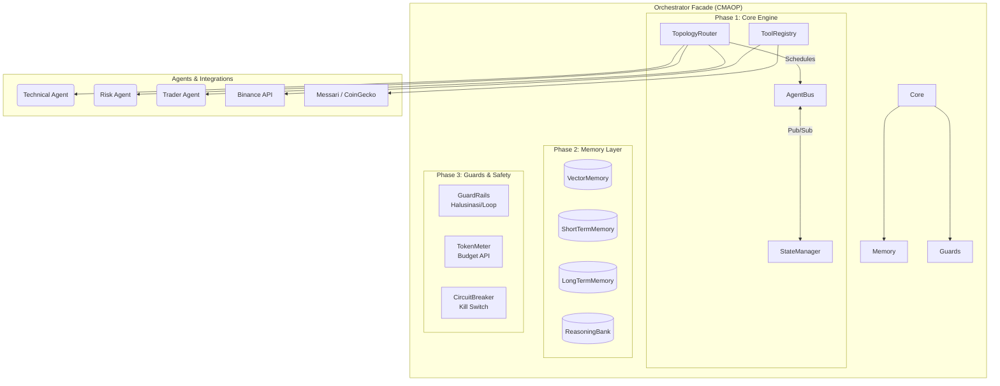

# TradingAgents (CMAOP) 🚀


Selamat datang di repository **TradingAgents**. Proyek ini adalah monorepo yang menggabungkan **Custom Multi-Agent Orchestration Platform (CMAOP)** canggih di sisi backend (Python) dan Dashboard pemantauan real-time di sisi frontend (React).

Sistem ini bertindak layaknya tim *Hedge Fund* otonom berbasis LLM, dengan agen-agen spesialis (Technical Analyst, Risk Manager, fundamental, dll) yang berkolaborasi untuk mengambil keputusan trading.

---

## 🏗 Arsitektur CMAOP

Platform orkestrasi ini dibangun dari nol (tanpa framework eksternal) untuk performa maksimum dan kontrol penuh atas *safety* dan *memory*.



## 🧠 Komponen Sistem

Sistem ini dibagi menjadi 4 fase pengembangan yang telah selesai 100%:

1. **Core Engine**: Mesin utama yang mengatur agen. Menggunakan `AgentBus` (event-driven), `StateManager` (shared memory per sesi), dan `TopologyRouter` (mendukung *Pipeline*, *Hierarchical*, *Mesh*).
2. **Memory Layer**: Database vektor (`VectorMemory`) untuk pencarian semantik, `ShortTermMemory` dengan TTL otomatis, memori lintas sesi `LongTermMemory` untuk rekapan PnL, dan `ReasoningBank` untuk menyimpan pola trajektori AI yang sukses.
3. **Guards & Safety**: Fitur keamanan enterprise. `GuardRails` mencegah halusinasi ticker/action, `TokenMeter` membatasi biaya LLM API (`BudgetExceeded`), dan `CircuitBreaker` sebagai *global kill switch* serta pelindung *drawdown* portofolio.
4. **SDK & CLI**: Decorator Python terpadu (`@agent` dan `@tool`) memudahkan pembuatan agen baru, serta `orchctl` sebagai CLI untuk pemantauan terminal.

---

## 🚀 Instalasi & Menjalankan Platform

Proyek ini direkomendasikan menggunakan `uv` untuk instalasi *backend* Python yang super cepat, dan `npm` untuk *frontend*.

### 1. Backend Engine (FastAPI & AI Agents)

```bash
cd TradingAgents
uv sync
uv run uvicorn api.main:app --reload --port 8000
```

### 2. Frontend Dashboard (React & Vite)
Panel untuk interaksi visual, *Trade Confirmation*, & *Live Portfolio*.

```bash
cd dashboard
npm install
npm run dev
```

### 3. Menggunakan CLI (`orchctl`)
Semua monitoring orkestrasi dapat dilakukan dari terminal.

```bash
cd TradingAgents
# Cek kesehatan platform & status Circuit Breaker
uv run python -m orchestrator.cli.orchctl status

# Lihat agen dan tools yang terdaftar
uv run python -m orchestrator.cli.orchctl agents
uv run python -m orchestrator.cli.orchctl tools

# Cek penggunaan token LLM
uv run python -m orchestrator.cli.orchctl token-usage --demo

# Jalankan satu siklus trading penuh untuk BTC!
uv run python -m orchestrator.cli.orchctl run --ticker BTCUSDT --topology pipeline
```

---

## 💻 Contoh Penggunaan (SDK)

Menyesuaikan atau menambah agen baru sangat mudah dengan pendekatan deklaratif.

```python
from orchestrator.sdk import agent, tool, build_orchestrator

@tool(name="get_price", category="market")
def get_price(ticker: str) -> float:
    return 65_000.0  # logika fetch API

@agent(role="Market Analyst", priority=10)
async def analyst(state, bus, tools, **kwargs):
    price = tools.get_for_agent(["market"])["get_price"](ticker=state.ticker)
    state.add_decision({"action": "BUY", "confidence": 0.85})
    return {"status": "analysis_complete"}

# Build & Run!
orch = build_orchestrator("BTCUSDT", topology="pipeline")
result = orch.run_sync()
print(f"Final Decision: {result.final_decision}")
```

---
*Hak Cipta © 2026. BimoBintang / TradingAgents.*
